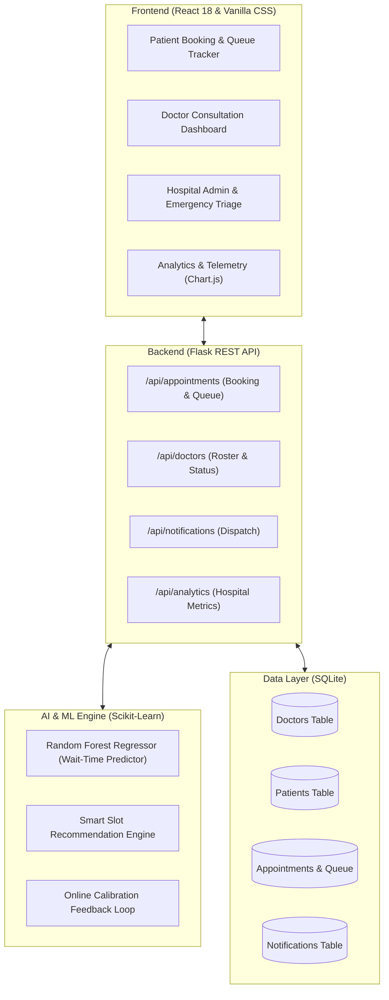

# 🏥 SmartCare AI — Smart Healthcare Appointment & Queue Management System

[](https://www.python.org/)
[](https://flask.palletsprojects.com/)
[](https://react.dev/)
[](https://scikit-learn.org/)
[](LICENSE)

An intelligent healthcare appointment platform that predicts patient waiting times, manages real-time queues, handles emergency triage preemption, and recommends optimal consultation slots based on doctor availability, hospital congestion, and predictive ML models.

---

## 📌 Problem Statement & Solution

* **Problem:** Patients experience prolonged waiting times and unpredictable delays in hospitals due to static appointment scheduling and unmanaged queue bottlenecks.
* **Solution:** SmartCare AI combines **predictive waiting-time machine learning (Random Forest)** with **dynamic queue optimization** to minimize waiting delays, provide transparent live queue tracking, and streamline hospital workflow.

---

## 🌟 Key Features

| Feature | Description |
| :--- | :--- |
| **👤 Patient Portal & Booking** | Multi-profile patient registration, symptoms log, and intelligent doctor selection across medical departments (*Cardiology, Neurology, Pediatrics, Orthopedics, General Medicine, Dermatology*). |
| **🧠 AI Wait-Time Prediction** | Ensemble Random Forest Regressor predicting wait minutes based on doctor consultation speed, diurnal peak congestion (10-12 / 14-16), queue depth, and emergency volume. |
| **🌟 Smart Slot Recommendation** | AI-driven slot ranking badging optimal slots with *Shortest Wait*, *Quick Consult*, or *Peak Congestion Warnings*. |
| **⏱️ Live Queue Tracker** | Visual `#In-Line` position ring, assigned consultation room, and real-time status updates (*Waiting in Lobby* vs. *Called into Room*). |
| **🩺 Doctor Dashboard** | Real-time queue sorted by clinical priority (*Emergency > Priority > Routine*), one-click patient calling, and consultation completion logger. |
| **🚨 Emergency Preemption** | Priority triage injection that automatically moves urgent patients to the front of the queue and broadcasts instant delay alerts. |
| **📺 Public Hospital Monitor** | Live waiting room dashboard displaying ongoing ticket numbers and queue lengths across all rooms. |
| **📊 Analytics & Telemetry** | Interactive Chart.js visualizers showing hourly patient flow, department wait times, status distribution, and ML feature importance weights. |
| **🔔 Real-Time Notifications** | In-app notification drawer with sound alerts, live toasts, and delay notifications. |

---

## 🏗️ System Architecture



---

## 📁 Repository Structure

```
smart-healthcare-system/
├── app.py                  # Flask full-stack REST API server & static file host
├── database.py             # SQLite database layer, schema, and sample dataset
├── ml_model.py             # AI Random Forest waiting-time & slot recommendation engine
├── healthcare.db           # SQLite database (auto-initialized on start)
├── requirements.txt        # Python package dependencies
├── .gitignore              # Git ignore rules for clean repository
├── README.md               # Complete project documentation
└── static/
    ├── index.html          # Single Page Application entry point & CDN dependencies
    ├── css/
    │   └── style.css       # Calming blue-and-white design system & animations
    └── js/
        └── app.js          # React 18 frontend components, role views, & Chart.js
```

---

## 🚀 Getting Started

### 1. Prerequisites
- **Python 3.10+**
- **pip**

### 2. Installation & Setup

1. **Clone the repository:**
   ```bash
   git clone https://github.com/shrishribs2067-dev/smart-healthcare-system.git
   cd smart-healthcare-system
   ```

2. **Install dependencies:**
   ```bash
   pip install -r requirements.txt
   ```

3. **Start the application:**
   ```bash
   python app.py
   ```

4. **Open your browser:**
   Navigate to **[http://127.0.0.1:5000](http://127.0.0.1:5000)** or **[http://localhost:5000](http://localhost:5000)**.

---

## 📡 API Endpoints

### 🩺 Doctors
- `GET /api/doctors` — List all doctors with active queue lengths & current room status.
- `POST /api/doctors/<id>/toggle-status` — Toggle doctor availability (*On Duty / Off Duty*).

### 👥 Patients & Appointments
- `GET /api/patients` — List registered patients.
- `POST /api/patients/register` — Register a new patient profile.
- `GET /api/appointments` — Fetch appointments with filtering by doctor, patient, or date.
- `POST /api/appointments/book` — Book appointment with AI predicted wait-time calculation.
- `POST /api/appointments/<id>/call` — Call patient into room and trigger notification.
- `POST /api/appointments/<id>/complete` — Complete consultation and trigger AI online learning loop.
- `POST /api/appointments/<id>/cancel` — Cancel appointment and re-index waiting queue.

### 🧠 AI & Analytics
- `POST /api/predict-wait-time` — Calculate expected wait minutes, confidence interval, and insights.
- `GET /api/recommended-slots` — Get time slots ranked by expected wait duration.
- `GET /api/analytics` — Hospital telemetry, department wait times, and feature importance.
- `POST /api/ml/retrain` — Retrain Random Forest model with updated clinical weights.
- `POST /api/emergency-admission` — Inject acute emergency patient with priority preemption.

---

## 🛡️ License

This project is licensed under the MIT License — see the [LICENSE](LICENSE) file for details.
